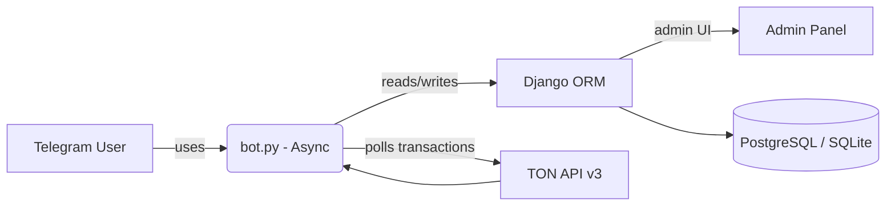

# Telegram Store Bot 🛒⚡

   

A fast, reliable Telegram store bot that allows users to **browse products, top up balances using TON cryptocurrency, and purchase items** — all from Telegram.

**Django** is used only for the admin panel and ORM models; the bot runs as a standalone async application (`bot.py`).

---

## Table of Contents
1. [Features ✨](#features)
2. [Highlights 🚀](#highlights)
3. [Setup & Installation 🛠️](#setup--installation)
4. [Bot Commands 📋](#bot-commands)
5. [TON Polling Overview 🧭](#ton-polling-overview)
6. [Database Notes ⚙️](#database-notes)
7. [Best Practices ✅](#best-practices)
8. [Architecture Diagram 🧩](#architecture-diagram)
9. [Security & Privacy 🔐](#security--privacy)
10. [Testing & Development 🧪](#tests--development)
11. [License 📜](#license)
12. [Disclaimer 🤖](#disclaimer)

---

## Features

* Product browsing by categories 🏷️
* Purchase products using TON cryptocurrency 💰
* Generate TON payment links 🔗
* Track user transactions and purchase history 📝
* Background tasks: TON price updater, transaction processor ⏱️
* Multi-language support 🌐
* Timezone handling ⏰

---

## Highlights

* **TON Center API v3** integration with pagination — ensures no on-chain transactions are missed.
* Thread-safe async usage of Django ORM (`sync_to_async(thread_sensitive=True)`).
* Atomic, idempotent transaction processing — prevents double-crediting.
* Purchases lock **only one `ProductDetail` row** at a time.
* LRUCache for recent TX deduplication; TTL caches for settings and price.
* Clean separation: Django for admin & ORM; bot runs independently.

---

## Setup & Installation

1. **Clone repository:**

```bash
git clone --branch TON-payment https://github.com/RezaTaheri01/telegram-store-bot.git
cd telegram-store-bot/telegram_store
```

2. **Install dependencies (use [virtualenv](https://www.w3schools.com/python/python_virtualenv.asp) recommended):**

```bash
pip install --upgrade pip
pip install -r req.txt
```

3. **Collect static files:**

```bash
python manage.py collectstatic --noinput
```

4. **Create a `.env` file:**


```env
# Bot Token(@BotFather)
TOKEN=your-telegram-api-token   
BOT_LINK=https://t.me/giftShop2025Bot

# Command to clear BotSetting cache via bot(Change it on deployment and keep it private)
UPDATE_SETTING_COMMAND=update

# Django secret key
SECRET_KEY=CHANGE_ME_IN_PRODUCTION

# Set to False when deploying!
DEBUG=True   

# No slash at the end
ALLOWED_HOSTS=localhost,127.0.0.1,your-domain.com,www.your-domain.com
ADMIN_URL=adminadmin

# No slash at the end
# Local Storage Image Domain(Site Domain) 
# SITE_DOMAIN=https://your-domain.com

# Database
#DB_ENGINE=postgresql
#DB_NAME=mydb
#DB_USER=postgres
#DB_PASS=secret123
#DB_HOST=localhost
#DB_PORT=5432
```

5. **Run migrations & create superuser:**

```bash
python manage.py makemigrations users payment products
python manage.py migrate
python manage.py createsuperuser
```

6. **Start Django backend:**

```bash
python manage.py runserver
```

7. **Configure Bot Settings** in Django Admin:

* Wallet Currency: 3-letter code (USD)
* TON Price Delay: 120s
* TON Fetch Limit: 250
* TON Network Delay: 10s
* Optional: Disable Product Images for faster UI

8. **Start the bot:**

```bash
python bot.py
```

---

## Bot Commands

* `/start` – Start the bot and show main menu
* `/menu` – Show main menu
* `/balance` – Check balance
* `/pay` – Generate TON payment link
* `/set_timezone` – Set timezone based on location
* `Update Settings` – Refresh bot settings

> **Note:** For `/set_timezone` to work, uncomment the relevant command handlers in `bot.py`.

---

## TON Polling Overview

1. Read `TonCursor` (`last_lt`, `last_hash`) from DB.
2. Request transactions via TON v3 API.
3. Process results **oldest → newest** for idempotency.
4. Each transaction:

   * Normalize `hash` (lowercase)
   * Skip if already in cache/DB
   * Ensure user exists
   * Update balance inside `transaction.atomic()` with `select_for_update()`
   * Record transaction
   * Add hash to cache after successful processing
5. Update `TonCursor` only after processing completes.

This ensures **no transactions are skipped** and **no double-processing occurs**.

---

## Database Notes

* `TonCursor` → `last_lt` (BigInteger) & `last_hash` (char 128)
* `Transaction.tx_id` should be unique
* `ProductDetail` → inventory rows; lock **one row per purchase** with `select_for_update(skip_locked=True)`

---

## Best Practices

* Use **PostgreSQL** in production (SQLite is fragile for locking).
* Keep `TON Fetch Limit` moderate (100–500) based on load.
* Monitor LRU cache size (default: 10,000 entries).
* Run `bot.py` as a **background worker/service**.
* Separate **web (Django)** and **bot (worker)** processes.

---

## Architecture Diagram



---

## Security & Privacy

* Keep `SECRET_KEY` and API keys **out of source control**.
* Use **HTTPS** for webhooks (if switching to webhook mode).
* Validate and sanitize user input.

---

## Tests & Development

* Manual testing for payment flows recommended.
* Unit tests suggested for:

  * `apply_transaction()` atomic behavior
  * `TonCursor` updates
  * Polling edge cases

---

## License

GPL-3.0 — see `LICENSE` file.

---

## Disclaimer

Parts of this README were assisted by AI. All final code and implementation decisions were made manually by the author.
